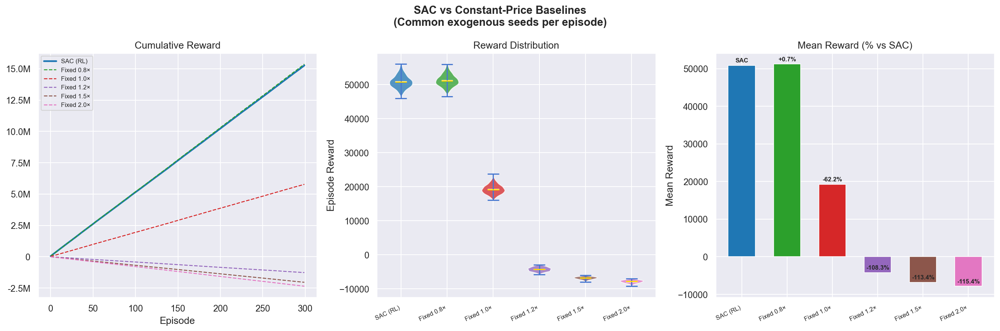
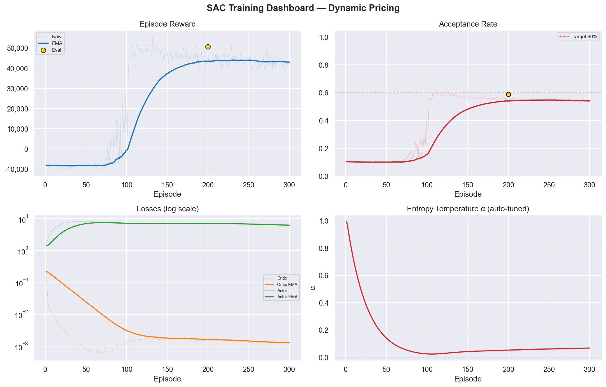

# SAC Dynamic Pricing in a Custom Gymnasium Environment

A from-scratch PyTorch implementation of Soft Actor-Critic (SAC) learns a
continuous price multiplier inside a custom, stochastic ride-share simulator.
The project includes prioritized replay, automatic entropy tuning, paired
baseline evaluation, machine-readable benchmark output, and six diagnostic
plots.

The most useful finding is a trade-off, not a benchmark victory: on 300 held-out
scenario seeds, the tracked SAC checkpoint earns **1.80% more simulated gross
revenue** than the strongest fixed-price baseline, but its engineered objective
reward is **0.68% lower** and its aggregate acceptance is **3.91 percentage
points lower**.

> This is an educational, synthetic single-zone simulation. It uses no Uber
> data, is not affiliated with Uber, and is not suitable for real pricing
> decisions. “OpenAI environment” here means a Gymnasium-compatible environment;
> no OpenAI API or pretrained model is used.

## Benchmark result

The canonical benchmark evaluates one deterministic checkpoint for 300
simulated days per strategy (144 ten-minute steps each). Every policy receives
the same exogenous RNG seed sequence, 7777–8076. Actions still alter future
demand and supply, so endogenous market trajectories correctly differ by
policy.

| Metric, mean ± scenario SD | SAC | Fixed 0.8× |
|---|---:|---:|
| Engineered objective reward | 50,873 ± 1,843 | **51,223 ± 1,730** |
| Simulated gross revenue | **$38,111 ± $1,427** | $37,435 ± $1,299 |
| Aggregate acceptance | 58.80% | **62.71%** |
| Average price multiplier | 0.854× | 0.800× |
| Simulated rides served | 3,730 ± 139 | **3,899 ± 135** |
| Steps meeting the 60% acceptance target | 3.15% | **100.00%** |

The paired SAC-minus-baseline reward difference is **−350.67**, with a 95%
interval of **[−382.77, −318.56]** across the 300 scenario pairs. SAC wins 12%
of those pairs. Relative to fixed 0.8×, SAC changes:

- simulated gross revenue by **+1.804%**;
- objective reward by **−0.685%**;
- served rides by **−4.353%**;
- aggregate acceptance by **−3.914 percentage points**.

These values measure scenario variation for one trained checkpoint, not
robustness across multiple training seeds. Full precision, software versions,
protocol metadata, and the checkpoint SHA-256 are in
[`results/benchmark.json`](results/benchmark.json).



## Training snapshot

The tracked `best.pt` was selected at episode 200 during a 300-episode
development run. The full run contains 43,200 environment steps; the selected
checkpoint contains 25,800 gradient updates after warm-up.

| Training metric | First 20 episodes | Last 20 episodes |
|---|---:|---:|
| Mean episode reward | −8,622 | 42,643 |
| Mean aggregate acceptance | 9.81% | 53.87% |

After warm-up, mean critic loss over the first and last 20 logged episodes fell
from 0.02280 to 0.001256. Automatic entropy temperature decreased from
approximately 0.996 to 0.067.
The included training log and figures now describe this same 300-episode run;
the default configuration remains 4,000 episodes for a full experiment.



## Environment

`UberPricingEnv` follows the Gymnasium API and passes Gymnasium’s environment
checker.

| MDP element | Definition |
|---|---|
| Observation | 12 continuous features: demand, supply, demand/supply ratio, cyclic hour, weather, event, current price, surge memory, churn memory, previous acceptance, and demand trend |
| Action | One continuous price multiplier in `[0.8×, 3.0×]` |
| Step | 10 simulated minutes |
| Time limit | 144 steps, or one simulated day; this is a truncation rather than a terminal market state |
| Demand | Two-peak circadian anchor with Markov weather, event shocks, noise, price elasticity, and churn suppression |
| Supply | Mean-reverting driver supply with price attraction and stochastic noise |

Aggregate acceptance is a deterministic logistic response:

```text
acceptance = clip(
    1 / (1 + exp(2.6(price - 1)
                 + 1.6 surge_memory
                 + 2.2 churn_memory)),
    0.08,
    0.98,
)
```

With the current 0.8× lower price bound and non-negative fatigue, the maximum
possible acceptance is **62.715%**. Therefore, 60% is a narrow target rather
than a general fairness guarantee. The environment has no demographic groups
or individual-level fairness model.

### Reward

The raw objective combines simulated revenue with service and stability terms:

```text
reward =
    revenue
    + 0.40 * service_efficiency * revenue
    - 4.00 * max(0, 0.60 - acceptance) * revenue
    - 0.60 * churn_memory * demand * 0.50
    - 0.10 * idle_drivers
    - 0.35 * abs(price - previous_price) * demand
```

`service_efficiency = served / max(willing, 1)`. The replay buffer stores this
reward multiplied by `5e-4`; logs and benchmark tables report the unscaled
objective. Objective reward is not revenue, profit, or a real currency amount.

## SAC implementation

The agent is implemented directly in PyTorch rather than through an RL library:

- squashed-Gaussian actor for bounded continuous prices;
- twin critics and minimum-Q targets;
- Polyak target updates;
- automatic entropy-temperature tuning;
- prioritized experience replay with importance-sampling weights;
- orthogonal initialization, LayerNorm, and gradient clipping.

Default training settings:

| Setting | Value |
|---|---:|
| Actor/critic hidden layers | 2 × 256 |
| Episodes / steps | 4,000 / 576,000 |
| Replay capacity | 200,000 |
| Warm-up steps | 3,000 |
| Batch size | 256 |
| Learning rate | 3e-4 |
| Discount `γ` | 0.99 |
| Target update `τ` | 0.005 |
| PER `α` / initial `β` | 0.6 / 0.4 |

## Quick start

Run commands from this directory because output paths are project-relative.
Python 3.10 or newer is recommended.

```powershell
python -m venv .venv
.\.venv\Scripts\Activate.ps1
python -m pip install --upgrade pip
python -m pip install -r requirements.txt

# Evaluate the included checkpoint and rewrite results/benchmark.json.
python main.py --mode eval --device cpu

# Regenerate the benchmark plus all six plots.
python main.py --mode plot --device cpu
```

The default benchmark uses 300 episodes per strategy and takes roughly two
minutes on the tested machine. For a quick pipeline check:

```powershell
python main.py --mode eval --device cpu --benchmark-episodes 20
```

Train into a named run directory so exploratory work does not overwrite the
published artifacts:

```powershell
# Full train → select best checkpoint → benchmark → plots.
python main.py --mode all --run-name sac-seed-0 --seed 0

# Short smoke run with a small benchmark.
python main.py --mode all --run-name smoke --eps 50 --benchmark-episodes 10 --device cpu
```

Named runs write to `checkpoints/<run-name>/` and `results/<run-name>/`.

## Tests

```powershell
python -m unittest discover -s tests -v
```

The suite covers Gymnasium compliance, deterministic seeded rollouts, action
and observation bounds, decision-context logging, time-limit behavior,
prioritized replay, deterministic actor inference, SAC updates, and benchmark
serialization.

Canonical artifacts were generated with Python 3.13.9, Gymnasium 1.2.3, NumPy
2.4.3, and PyTorch 2.6.0+cu124.

## Repository layout

```text
uber_rl/
├── environment.py          # Custom synthetic Gymnasium environment
├── agent.py                # SAC, actor/critics, uniform replay, and PER
├── config.py               # Training and benchmark configuration
├── train.py                # Seeded training, evaluation, logging, checkpoints
├── evaluate.py             # Paired SAC vs fixed-price rollouts
├── benchmark.py            # Statistics, provenance, and JSON reporting
├── visualize.py            # Six diagnostic figures
├── main.py                 # train / eval / plot / all CLI
├── tests/                  # Regression and smoke tests
├── checkpoints/best.pt     # Published inference snapshot
└── results/                # Canonical log, benchmark JSON, and figures
```

## Limitations

- The simulator is synthetic, single-zone, and not calibrated to real riders,
  drivers, costs, or regulations.
- Ride counts are continuous quantities; “revenue” is simulated gross fare,
  with no driver payouts or operating costs.
- The current checkpoint mostly prices near the lower action bound. It does not
  establish strong surge responsiveness.
- The benchmark uses one training run and a small family of fixed baselines; it
  does not establish training-seed robustness or optimality.
- Aggregate acceptance is an access proxy, not demographic or individual
  fairness.
- Saved `.pt` files are inference snapshots, not resumable training states:
  optimizer, replay-buffer, and RNG state are not stored.
- Load only trusted PyTorch checkpoints.

The clearest next experiment is a reward/acceptance redesign followed by
multiple training seeds and comparison against tuned fixed and rule-based
demand/supply policies.
